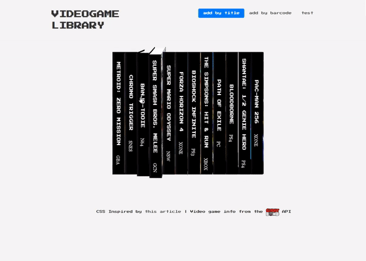

# virtual-backlog
A prototype web app for storing and viewing a videogame collection, using the Giant Bomb API, Express, Node, and Sequelize.

# tech
jQuery, Node, Express, MySQL, Sequelize, Bootstrap, CSS3, HTML5

# goals
Videogame collectors love to organize and display their collections, but this is only possible with physical collections. Videogame library was built to allow digital, physical, or mixed collections to be stored and displayed. This project is a prototype of the much more robust, fully-featured Virtual Backlog (https://virtualbacklog.herokuapp.com/), which allows user registration, sorting, and cleaner UI/UX.

# try it yourself!
https://secret-taiga-28497.herokuapp.com/
Games can be added to the library either by scanning a barcode or by doing a simple text search. Games can be deleted by going to the "test" nav, displaying the whole database in JSON, and clicking the game to be deleted.

